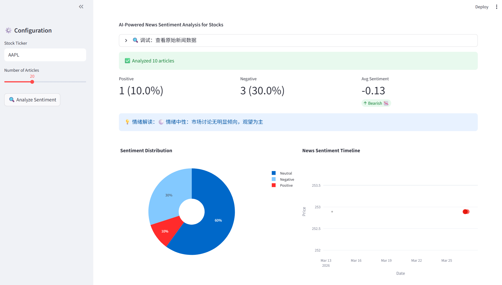
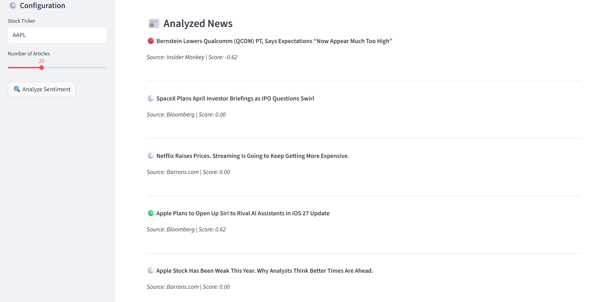

# 📊 Market Sentiment Alpha

> AI-Powered News Sentiment Analysis for Stocks

[](https://www.python.org/)
[](LICENSE)

## ✨ 功能

- 📰 实时抓取 Yahoo Finance 新闻
- 🤖 Twitter-RoBERTa 情感分析模型
- 📊 交互式情绪分布可视化
- 🔄 支持全球股票代码 (AAPL, TSLA, 600519.SS...)

## 🚀 快速开始

```bash
git clone https://github.com/glztl/sentiment-alpha.git
cd sentiment-alpha
uv sync
uv run streamlit run app.py
```

## 🖼️ 项目演示

### 主界面

